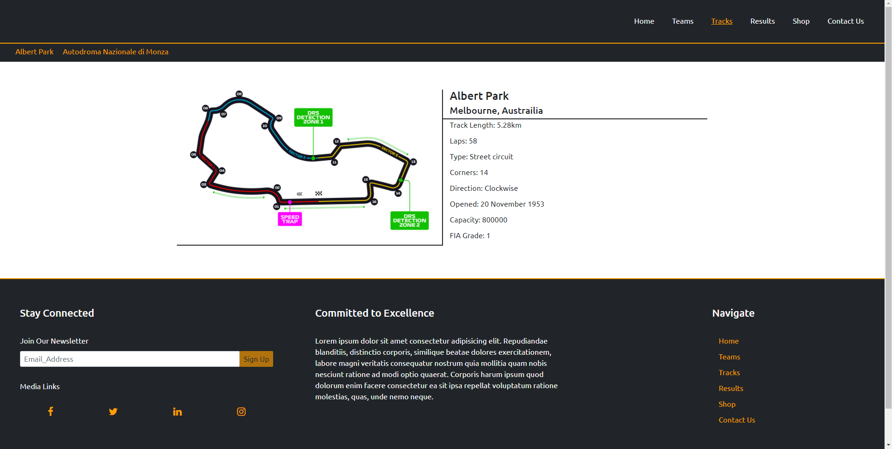
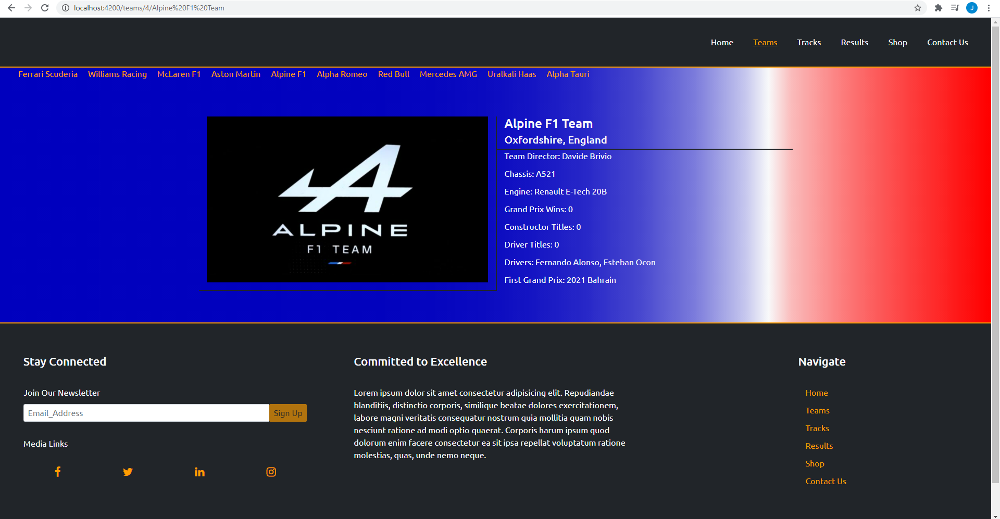
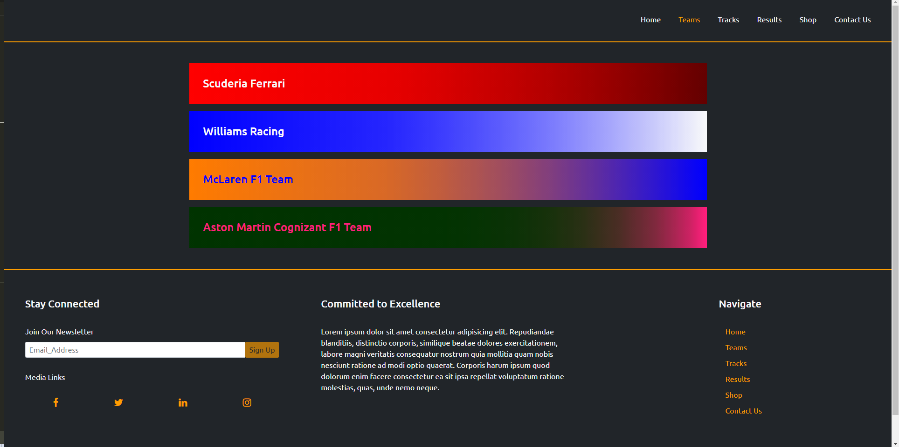

# Formula-Uno

work in progress

<!-- ## Technologies Used -->

<!-- This project was generated with:

- [Angular CLI](https://github.com/angular/angular-cli) version 10.1.7.
- [Bootstrap](https://getbootstrap.com/)
- [Typescript](https://www.typescriptlang.org/)
- HTML
- CSS
- [Weather api](https://openweathermap.org/api)
- [Firebase Database](https://firebase.google.com/)
- [Covid api](https://github.com/disease-sh/API)
- [Github](https://github.com/)
- [Font Awesome](https://fontawesome.com/) -->

<!-- ## User Experience -->

<!-- ## Testing -->

<!-- The project has been tested on various differant screens to ensure that it is a mobile friendly site. Manual site testing shows that all links are working correctly and that competition votes are being counted and recorded correctly. Information coming from the weather and covid api are updating correctly.

A small shadow can be observed on the right side of the images on the home page when the focused in images are compressing back to their original size but this disappears after a second. -->

<!-- ## Local Deployment -->

<!-- If you wish to copy the project follow these steps:

- Click on the green Code button.
- To clone the repo using http copy the provided address.
- Open a git bash terminal.
- Navigate to a folder which will hold the cloned project.
- Type: git clone `copied address` and press enter.
- Open the project in your editor.
- Run `npm install` to include dependencies.
- Run the development server with `ng serve`.
- Get new api keys for the news section. -->

<!-- ## Credits -->

<!-- - [Oraclefrontovik](https://oraclefrontovik.com/2020/04/19/openweathermap-two-useful-conversions-for-wind-data/) for help implementing a compass direction pipe.
- [Max Schwarzmuller](https://academind.com/) for help with the authentication service.
- [Stack Overflow](https://stackoverflow.com/) the solution to a lot of questions. -->

<!-- ## Further help -->

<!-- To get more help on the Angular CLI use `ng help` or go check out the [Angular CLI README](https://github.com/angular/angular-cli/blob/master/README.md). -->
